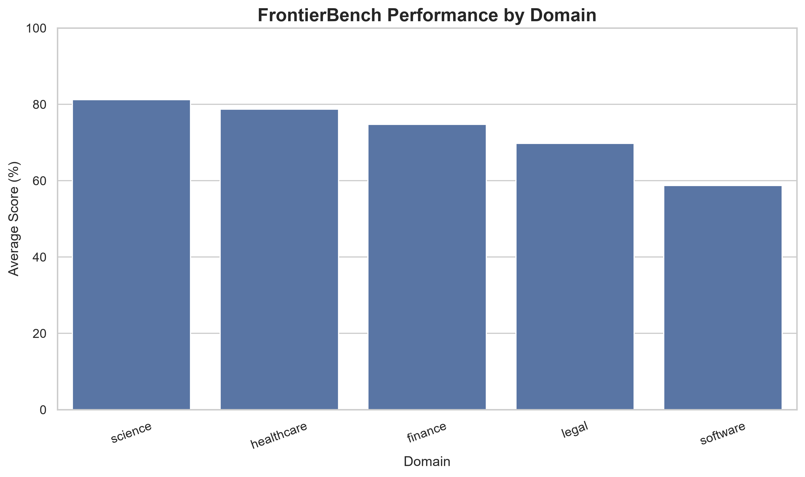
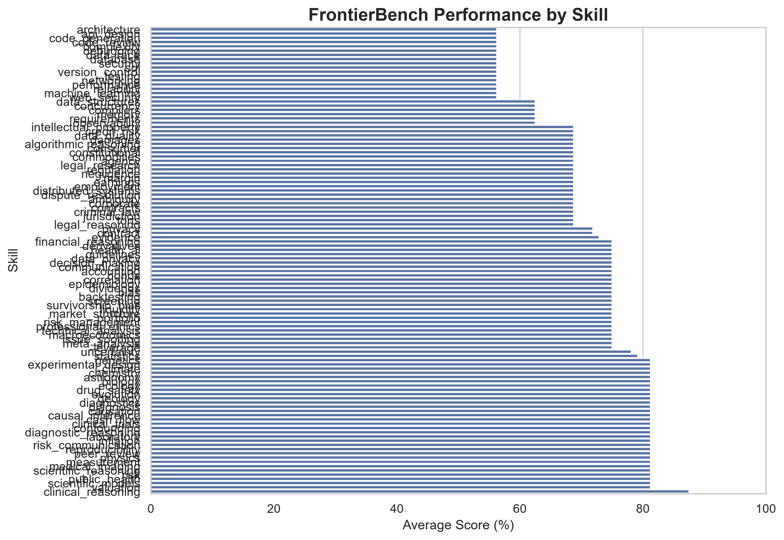
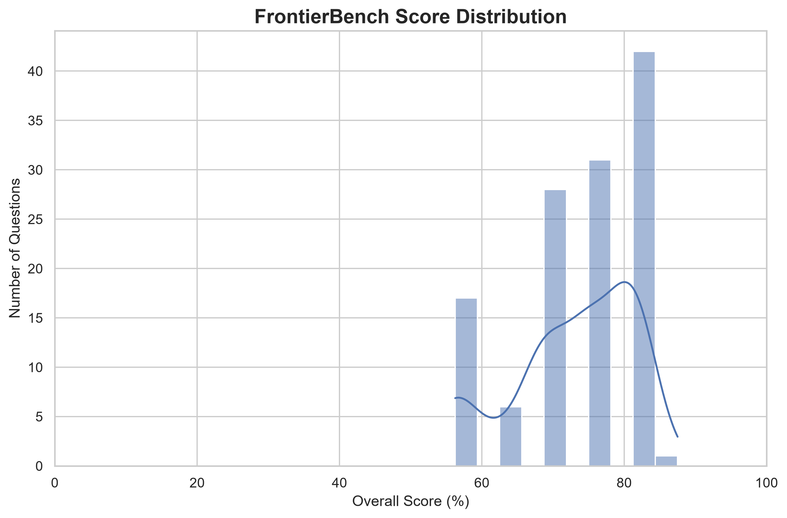
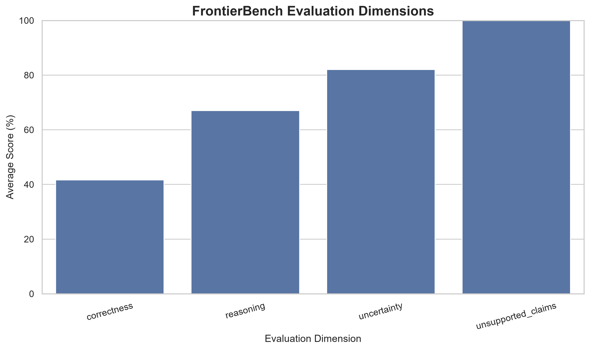

# \# FrontierBench

# 

# \## AI Reasoning Evaluation Across High-Stakes Domains

# 

# FrontierBench is an AI evaluation and benchmarking framework designed to investigate how AI systems perform across demanding reasoning tasks in \*\*Software Engineering, Finance, Legal Reasoning, Healthcare, and Science\*\*.

# 

# The project provides a reproducible pipeline for creating benchmark questions, generating model responses, applying question-specific evaluation rubrics, analyzing performance, and producing visual reports.

# 

# > \*\*Current status:\*\* FrontierBench v1.0 contains 125 benchmark questions, 125 question-specific rubrics, 110 distinct skills, and a complete evaluation, grading, analysis, and visualization pipeline.

# 

# \---

# 

# \## Why FrontierBench?

# 

# AI systems can perform exceptionally well on many general tasks while still struggling with complex reasoning, uncertainty, domain-specific constraints, and high-stakes decision making.

# 

# FrontierBench is designed to explore these weaknesses systematically.

# 

# Instead of evaluating AI using a single general score, the benchmark separates performance across multiple domains and reasoning skills.

# 

# The goal is to answer questions such as:

# 

# \- Where does an AI system reason well?

# \- Which domains expose weaknesses?

# \- How does performance vary across different skills?

# \- Does a response acknowledge uncertainty appropriately?

# \- Does the model make unsupported claims?

# \- How consistent is performance across different reasoning tasks?

# 

# \---

# 

# \# Benchmark Coverage

## Current Evaluation Status

FrontierBench v1.0 currently contains:

- 125 benchmark questions
- 5 evaluation domains
- 110 distinct skills
- 125 question-specific rubrics
- 4 evaluation dimensions
- A complete evaluation, grading, analysis, and visualization pipeline

### Pipeline Validation

## Pipeline Validation Results

The full 125-question benchmark was processed successfully through the evaluation pipeline.

| Domain | Questions | Average Score | Percentage |
|---|---:|---:|---:|
| Science | 25 | 3.25/4 | 81.25% |
| Healthcare | 25 | 3.15/4 | 78.75% |
| Finance | 25 | 2.99/4 | 74.75% |
| Legal | 25 | 2.79/4 | 69.75% |
| Software | 25 | 2.35/4 | 58.75% |
| **Overall** | **125** | **2.91/4** | **72.75%** |

**Strongest domain:** Science  
**Weakest domain:** Software

> These figures represent pipeline validation using mock model responses and should not be interpreted as benchmark results for a real AI model, mock model was implemented for product key reasons


visualizations/
├── domain_performance.png
├── skill_performance.png
├── score_distribution.png
├── evaluation_dimensions.png
├── domain_summary.csv
├── skill_summary.csv
├── dimension_summary.csv

## Visualizations

### Domain Performance



### Skill Performance



### Score Distribution



### Evaluation Dimensions




The complete benchmark pipeline has been successfully executed locally across all 125 questions.

The current repository includes **mock evaluation outputs used to validate the pipeline**, because live frontier-model API evaluation requires an API service with available usage credits.

Therefore, the current 72.75% aggregate score should be interpreted as a **pipeline/grading validation result, not a verified score for a specific frontier model**.

The benchmark is structured so that real model responses can be evaluated using the same pipeline when live model access is available.

# 

# FrontierBench currently contains:

# 

# | Metric | Value |

# |---|---:|

# | Total Questions | \*\*125\*\* |

# | Domains | \*\*5\*\* |

# | Questions per Domain | \*\*25\*\* |

# | Distinct Skills | \*\*110\*\* |

# | Question-Specific Rubrics | \*\*125\*\* |

# | Evaluation Dimensions | \*\*4\*\* |

# 

# \### Evaluation Domains

# 

# \#### Software Engineering

# Focuses on areas such as:

# 

# \- Debugging

# \- Algorithmic reasoning

# \- Software design

# \- Code reasoning

# \- Technical problem solving

# 

# \#### Finance

# 

# Focuses on:

# 

# \- Financial reasoning

# \- Valuation

# \- Risk analysis

# \- Investment reasoning

# \- Financial interpretation

# 

# \#### Legal Reasoning

# 

# Focuses on:

# 

# \- Issue spotting

# \- Contract reasoning

# \- Legal analysis

# \- Application of principles to facts

# \- Recognition of uncertainty and jurisdictional limitations

# 

# \#### Healthcare Reasoning

# 

# Focuses on:

# 

# \- Clinical reasoning

# \- Evidence interpretation

# \- Diagnosis reasoning

# \- Healthcare AI

# \- Uncertainty and limitations

# 

# \#### Science

# 

# Focuses on:

# 

# \- Physics

# \- Chemistry

# \- Biology

# \- Statistics

# \- Scientific reasoning

# 

# \---

# 

# \# Evaluation Framework

# 

# Each response is evaluated across four dimensions.

# 

# | Dimension | Description |

# |---|---|

# | Correctness | Whether the response reaches an accurate and relevant conclusion |

# | Reasoning | Quality and structure of the reasoning |

# | Uncertainty | Whether assumptions and limitations are appropriately acknowledged |

# | Unsupported Claims | Whether the response makes unjustified or fabricated claims |

# 

# Each dimension is scored from \*\*0 to 4\*\*.

# 

# \### Scoring Scale

# 

# | Score | Meaning |

# |---:|---|

# | 4 | Fully correct, complete, well-reasoned and appropriately qualified |

# | 3 | Mostly correct with minor omissions or imprecision |

# | 2 | Partially correct with meaningful omissions or weak reasoning |

# | 1 | Mostly incorrect or substantially incomplete |

# | 0 | Incorrect, irrelevant, fabricated or unsafe |

# 

# The overall score is calculated as the average of the four evaluation dimensions.

# 

# \---

# 

# \# Benchmark Architecture

# 

# ```text

# &#x20;                   FrontierBench

# &#x20;                        │

# &#x20;                        ▼

# &#x20;               Benchmark Dataset

# &#x20;                   125 Questions

# &#x20;                        │

# &#x20;                        ▼

# &#x20;                Evaluation Engine

# &#x20;                        │

# &#x20;                        ▼

# &#x20;                  Model Response

# &#x20;                        │

# &#x20;                        ▼

# &#x20;             Question-Specific Rubric

# &#x20;                        │

# &#x20;                        ▼

# &#x20;                   Grading Engine

# &#x20;                        │

# &#x20;                        ▼

# &#x20;                 Analysis Engine

# &#x20;                        │

# &#x20;                        ▼

# &#x20;               Visualization Engine

# &#x20;                        │

# &#x20;                        ▼

&#x20;                Benchmark Reports


## Author

**Onwubuya Ifeanyi Pedro (PEDROTECH)**

Data Analyst | Python Developer | AI Evaluation | Data Visualization

This project was developed for the **Eval Hackathon: "Build evals that expose frontier models' limits."** It also forms part of my practical portfolio, demonstrating how Python programming, data analysis, AI evaluation, and data visualization can be combined to build a structured and reproducible evaluation workflow.

This project was developed for the \*\*Eval Hackathon: "Build evals that expose frontier models' limits."\*\* It also forms part of my practical portfolio, demonstrating how Python programming, data analysis, AI evaluation, and data visualization can be combined to build a structured and reproducible evaluation workflow.

===

## Reproducibility

Clone the repository:

bash

```git clone https://github.com/ifypedro/frontierbench.git cd frontierbench```

Install dependencies:

bash

```pip install -r requirements.txt```

Build question-specific rubrics:

bash

```python src/build_rubrics.py```

Run evaluation in mock mode:

bash

```python src/run_evaluation.py --model gpt-5.6-sol --data data/all_benchmarks.jsonl --mock```

Grade responses:

bash

```python src/grading.py --input results/raw_results.jsonl --rubric data/benchmark_rubrics.json --output results/graded_results.jsonl```

Analyze results:

bash

```python src/analysis.py --input results/graded_results.jsonl --output results/analysis_summary.json```

Generate visualizations:

bash

```python src/visualization.py --input results/graded_results.jsonl --output visualizations```


Note: The current published evaluation results were generated using the project's mock evaluation mode for pipeline validation. Live frontier-model evaluation requires an API with available credits
